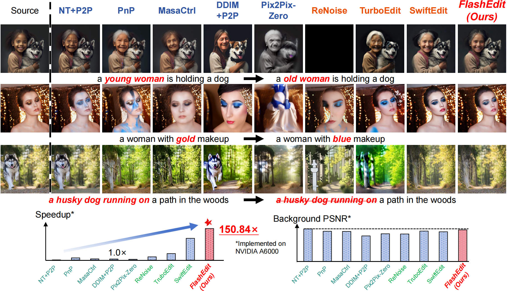
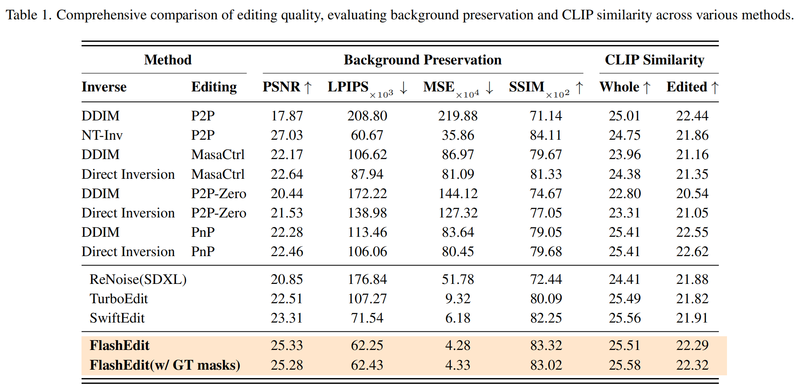
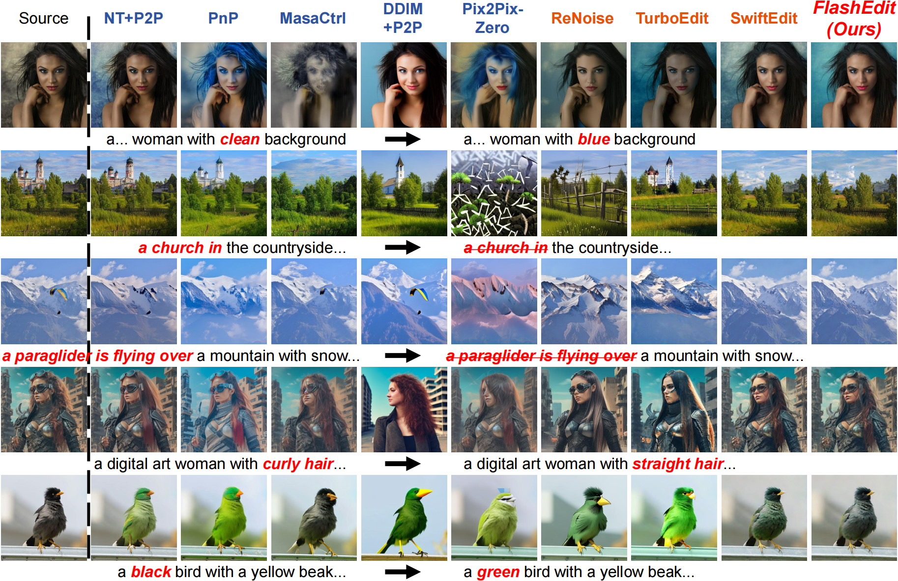

<h2>
FlashEdit: Decoupling Speed, Structure, and Semantics for Precise Image Editing
</h2>

[Junyi Wu*](https://junyiwucode.github.io/), [Zhiteng Li*](https://zhitengli.github.io), [Haotong Qin](https://htqin.github.io/), [Xiaohong Liu](https://jhc.sjtu.edu.cn/~xiaohongliu/), [Linghe Kong](https://www.cs.sjtu.edu.cn/~linghe.kong/), [Yulun Zhang†](http://yulunzhang.com/), and [Xiaokang Yang](https://scholar.google.com/citations?user=yDEavdMAAAAJ)

[[arXiv](https://github.com/JunyiWuCode/FlashEdit/)] [[supplementary material](https://github.com/JunyiWuCode/FlashEdit/)]


#### 🔥🔥🔥 News

- **2025-11:** This repo is released.

---

> **Abstract:** Text-guided image editing with diffusion models has achieved remarkable quality but suffers from prohibitive latency, hindering real-world applications. We introduce FlashEdit, a novel framework designed to enable high-fidelity, real-time image editing. Its efficiency stems from three key innovations: (1) a One-Step Inversion-and-Editing (OSIE) pipeline that bypasses costly iterative processes; (2) a Background Shield (BG-Shield) technique that guarantees background preservation by selectively modifying features only within the edit region; and (3) a Sparsified Spatial Cross-Attention (SSCA) mechanism that ensures precise, localized edits by suppressing semantic leakage to the background. Extensive experiments demonstrate that FlashEdit maintains superior background consistency and structural integrity, while performing edits in under 0.2 seconds, which is an over 150× speedup compared to prior multi-step methods. Our code will be made publicly available at https://github.com/JunyiWuCode/FlashEdit.





# <a name="results"></a>🔎 Results

We achieved an end-to-end latency speedup of 150.84× with negligible quality degradation, compared with DDIM + P2P. 

Detailed results can be found in the paper.

<details>
<summary>&ensp;Quantitative Comparisons (click to expand) </summary>
<li> Performance comparison of various methods on PieBench, Table 1 from the main paper. 
 
<p align="center">

</p>
</li>
</details>


<details open>
<summary>&ensp;More Comparisons across Different Methods (click to expand) </summary>
<p align="center">

</p>
 


</details>


## Citation

If you find the code helpful in your research or work, please cite the following paper.

```
@article{wu2025flashedit,
  title={FlashEdit: Decoupling Speed, Structure, and Semantics for Precise Image Editing},
  author={Wu, Junyi and Li, Zhiteng and Qin, Haotong and Liu, Xiaohong and Kong, Linghe and Zhang, Yulun and Yang, Xiaokang},
  journal={arXiv preprint arXiv:2509.22244},
  year={2025}
}
```

## 💡 Acknowledgements

This work is released under the Apache 2.0 license.
